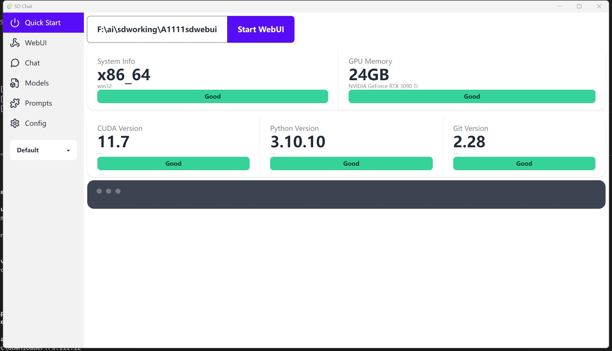
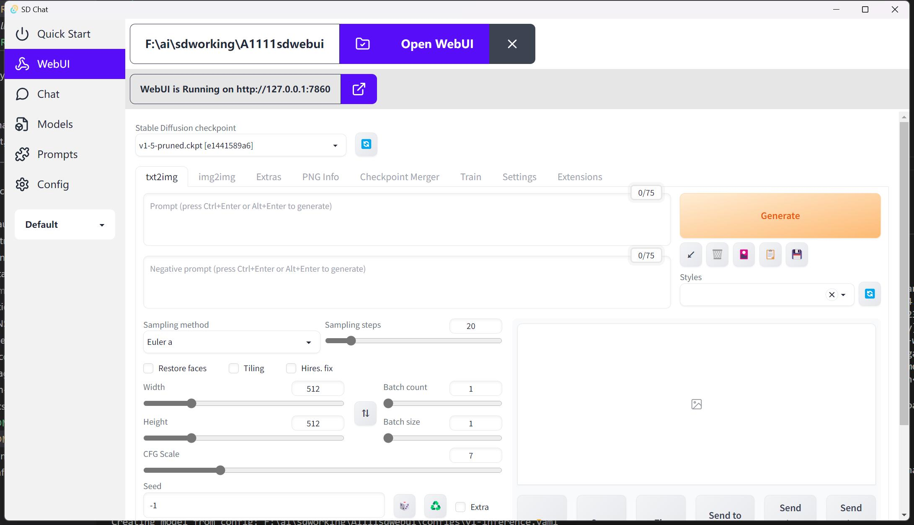
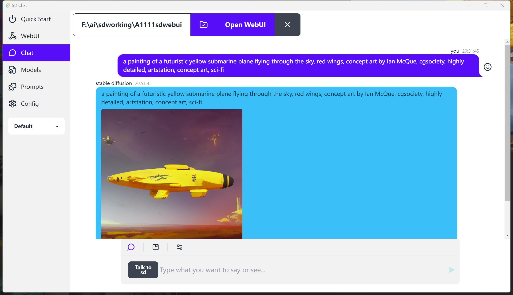

# Stable Diffusion Chat - 生成图片, 直接和 Stable diffusion 谈

SD Chat 是一个小工具, 帮助您配置并启动[stable diffusion WebUI](https://github.com/AUTOMATIC1111/stable-diffusion-webui), 然后可以通过对话模式与之交互.
参考借鉴了[Diffusion Chat](https://github.com/KAJdev/diffusion-chat)

中文 | [English](./README.md)

## 注意事项

- build 的时候需要把 WiX 下载解压到 C:\Users\xxxxxxxx\AppData\Local\tauri\WixTools 中. 因为 Tauri 从 github 下载 WiX 很慢.参考[下载 WiX 失败问题](https://github.com/lecepin/blog/blob/main/%E8%A7%A3%E5%86%B3%20Rust%20Tauri%201.0%20%E6%9E%84%E5%BB%BA%E6%97%B6%E4%B8%8B%E8%BD%BD%20WiX%E5%A4%B1%E8%B4%A5.md)
- 本项目使用的是 DaisyUI, [DaisyUI 文档](https://daisyui.com/components/)

## 功能特点

1. 检查硬件条件
2. 一键安装依赖并启动 webui
3. Pytorch 2.0
4. 可以保存提示词
5. Made with Rust and Nextjs and Typescript and TailwindCSS
6. 使用了 DaisyUI 的多主题
7. Sidecar 用了 llama.cpp 编译出来的 main 可执行程序

## 截图

## Todos

- [ ] Openai API
- [ ] Manage your models
- [ ] Prompts Gallery
- [ ] Configurations
