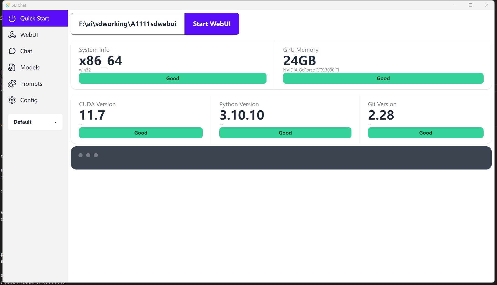
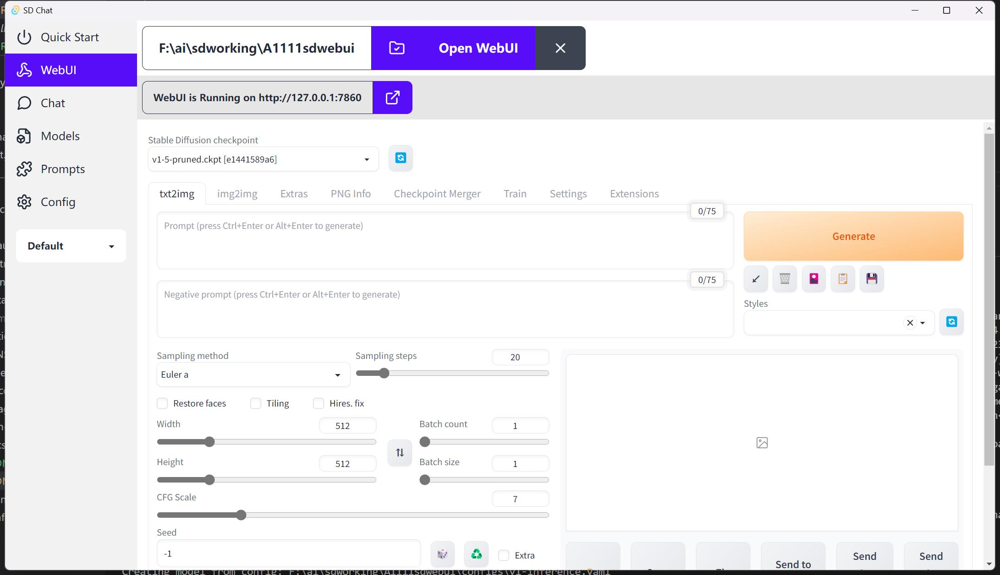
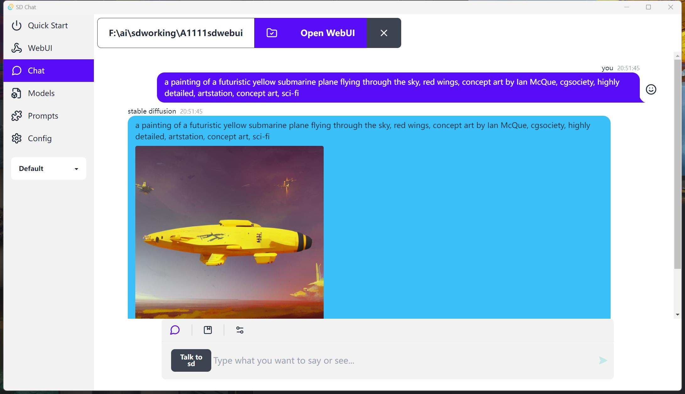

# Stable Diffusion Chat - a desktop tool to install stable diffusion webui and chat with it

SD Chat is a helper app for setting up [stable diffusion WebUI](https://github.com/AUTOMATIC1111/stable-diffusion-webui) and Llama on your own computer.
It's inspired by [Diffusion Chat](https://github.com/KAJdev/diffusion-chat)
It's created from Tauri + Next.js Template.

English | [简体中文](./README.cn.md)

## Features

1. Check hardware conditions and show stats
2. Install requirements and start WebUI with 1-click
3. Pytorch 2.0
4. Save your prompts
5. Made with Rust and Nextjs and Typescript and TailwindCSS
6. Multiple themes by DaisyUI
7. Sidecar with Llama.cpp main executable

## Screenshots






## Known Issues

- Encoding problem When Chat with Llama. Calling for help!
- Only support Windows 10/11 with Nvidia GPU for now

## Todos

- [ ] Openai API
- [ ] Manage your models
- [ ] Prompts Gallery
- [ ] Configurations
- [ ] AMD GPU
- [ ] MAC
- [ ] Linux

## Tauri + Next.js Template


This is a [Tauri](https://tauri.app/) project template using [Next.js](https://nextjs.org/),
bootstrapped by combining [`create-next-app`](https://github.com/vercel/next.js/tree/canary/packages/create-next-app)
and [`create tauri-app`](https://tauri.app/v1/guides/getting-started/setup).

This template uses [`pnpm`](https://pnpm.io/) as the Node.js dependency
manager.

## Getting Started for development

### Running development server and use Tauri window

After cloning for the first time, set up git pre-commit hooks:

```shell
pnpm prepare
```

To develop and run the frontend in a Tauri window:

```shell
pnpm dev
```

This will load the Next.js frontend directly in a Tauri webview window, in addition to
starting a development server on `localhost:3000`.

### Building for release

To export the Next.js frontend via SSG and build the Tauri application for release:

```shell
pnpm build
```

Please remember to change the bundle identifier in
`tauri.conf.json > tauri > bundle > identifier`, as the default value will yield an
error that prevents you from building the application for release.

### Source structure

Next.js frontend source files are located in `src/` and Tauri Rust application source
files are located in `src-tauri/`. Please consult the Next.js and Tauri documentation
respectively for questions pertaining to either technology.
